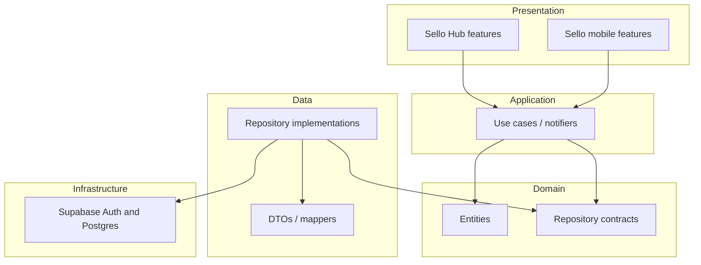
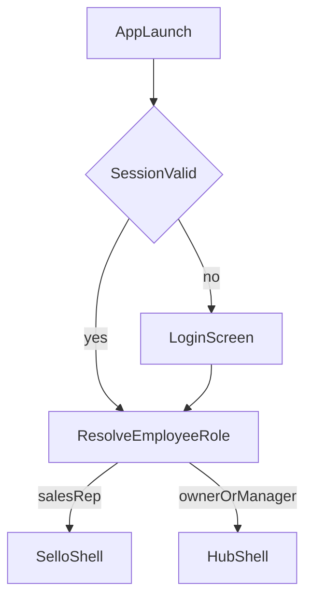

# Sello Architecture

This document is the technical source of truth for Sello. It records architectural decisions that guide implementation. Application features are not implemented yet; this document describes the **target** architecture.

Related documents:

- [README.md](README.md) — product overview
- [ROADMAP.md](ROADMAP.md) — delivery phases

---

## 1. Product & experiences

Sello is one Flutter client and one Supabase backend serving two presentation experiences:

| Experience | Users | Form factor | Purpose |
|------------|-------|-------------|---------|
| **Sello** | Sales Representatives | Phone / tablet first | Field sales: customers, catalog, inventory checks, order capture & signature |
| **Sello Hub** | Owners, Managers | Desktop / laptop first | Business operations: dashboard, insights, catalog & inventory admin, employees, reports, settings |

### Why two UIs, one core

Sales reps need speed and touch-optimized flows in the field. Owners and managers need density, tables, analytics, and administrative workflows. Those needs conflict if forced into one navigation model.

**Shared:** models, repositories, services, API access, use cases, validation, auth session.

**Separate:** navigation shells, page layouts, feature-specific presentation widgets, information density.

Hub must feel like an independent business console — not the sales app with extra routes.

---

## 2. High-level architecture



### Clean Architecture layers

| Layer | Responsibility | Allowed dependencies |
|-------|----------------|----------------------|
| **Presentation** | Widgets, pages, shells, UI state binding | Application, Domain (types), Flutter |
| **Application** | Use cases, orchestration, Riverpod notifiers | Domain |
| **Domain** | Entities, repository interfaces, pure business rules | Nothing from Flutter or Supabase |
| **Data** | Repository implementations, mappers, remote/local sources | Domain, Supabase / platform APIs |

**Dependency rule:** outer layers depend inward. Domain has no Flutter or Supabase imports. Widgets must not contain business logic.

Riverpod is the **composition root**: providers wire repositories and use cases into the presentation layer.

---

## 3. Folder structure (target)

```
lib/
  main.dart
  app.dart

  core/
    theme/              # Color, typography, spacing, radius, elevation, ThemeData
    responsive/         # AppBreakpoints, layout helpers, adaptive builders
    router/             # GoRouter config, redirects, route paths
    error/              # Failure types, mapping helpers
    constants/          # App-wide constants
    utils/              # Pure helpers (dates, formatting, etc.)

  shared/
    widgets/            # Design-system and reusable UI (buttons, cards, inputs, tables, states)
    models/             # Shared domain/DTO models used across experiences
    providers/          # Cross-feature shared providers (if needed)

  services/
    supabase/           # Client initialization, auth service facade
    session/            # Session / current user / role resolution

  features/
    mobile/             # Sello experience (presentation)
      authentication/
      dashboard/
      customers/
      products/
      inventory/
      orders/
      profile/
      shell/            # Sello navigation shell

    hub/                # Sello Hub experience (presentation)
      dashboard/
      customers/
      products/
      inventory/
      reports/
      analytics/
      employees/
      settings/
      shell/            # Hub navigation shell
```

### Where shared business logic lives

- **Domain entities and repository contracts** — under `shared/` (and/or a dedicated `domain/` area if the codebase grows), never under `features/mobile` or `features/hub` alone.
- **Repository implementations and Supabase access** — under `services/` and data modules referenced by shared providers.
- **`features/mobile` and `features/hub`** — **presentation only**: pages, local widgets, experience-specific layout. They consume shared providers/use cases.

As features mature, each domain capability (e.g. orders, products) may use an internal layout such as:

```
# Example shape for a shared capability (illustrative)
shared/features/orders/
  domain/
  data/
  application/
```

Presentation for that capability then lives in `features/mobile/orders/` and `features/hub/...` without duplicating repositories or use cases.

---

## 4. Module boundaries

| Module | Owns | Must not |
|--------|------|----------|
| `core` | Theme, breakpoints, router, errors, constants | Feature screens, Supabase queries |
| `shared` | Reusable widgets, shared models, cross-experience helpers | Hub-only or mobile-only navigation chrome |
| `services` | Supabase client, auth/session infrastructure | UI widgets |
| `features/mobile` | Sello pages and shell | Import Hub presentation; own repositories |
| `features/hub` | Hub pages and shell | Import mobile presentation; own repositories |

### Hard rules

1. **No business logic in widgets** — validation, pricing rules, permissions, and data orchestration live in application/domain layers.
2. **No Hub ↔ mobile presentation imports** — experiences stay independent at the UI boundary.
3. **No duplicated repositories or use cases** — one implementation, multiple UIs.
4. **No industry-specific hardcoding** — configuration and data drive behavior, not vertical-specific branches in core logic.
5. **Do not modify the database schema** unless explicitly instructed.

---

## 5. Riverpod usage

Riverpod provides dependency injection and reactive state.

### Conventions

- **`Provider`** — stable dependencies (repositories, services, config).
- **`Notifier` / `AsyncNotifier`** (and family variants) — mutable feature state and async workflows.
- Keep providers **feature-scoped** where possible; elevate only true app-wide concerns (auth session, router refresh, theme).
- UI widgets **watch/read** providers; they do not call Supabase directly.
- Prefer explicit provider overrides in tests.

### Auth and routing

App-level session providers expose:

- Current Supabase session / user
- Resolved employee profile and **role**
- Auth state changes for GoRouter `refreshListenable` / redirect

The router redirects based on those providers — not on ad-hoc checks inside random widgets.

---

## 6. Routing strategy (GoRouter)

A **single** `GoRouter` instance serves the entire app.

### Route namespaces

| Prefix | Audience |
|--------|----------|
| `/login` | Unauthenticated |
| `/sello/...` | Sales Representative experience |
| `/hub/...` | Owner / Manager experience |

### Navigation shells

- **`SelloShell`** — mobile-oriented chrome (bottom navigation on phone, rail on tablet, etc.).
- **`HubShell`** — Hub chrome (permanent sidebar on desktop, rail/adaptive on smaller widths).

Shells wrap their respective branch navigators. Deep links resolve into the correct shell when authenticated and authorized.

### Auth gate

Protected routes require a valid session. After login (or on cold start with a restored session), the router:

1. Resolves the employee role.
2. Sends Sales Representatives to `/sello/...`.
3. Sends Owners and Managers to `/hub/...`.
4. Blocks cross-experience access (e.g. a sales rep must not open Hub routes).

---

## 7. Authentication flow



### Details

1. **Credentials** — Supabase Authentication.
2. **Role resolution** — after a valid session, load the employee record and assigned role from the existing database (`Employees`, `Roles`). Schema is not modified by the app foundation.
3. **Routing** — role selects Sello vs Hub.
4. **Logout** — clear session and navigate to `/login`.

One authentication system serves both experiences.

---

## 8. User roles

| Role | Experience | Typical access |
|------|------------|----------------|
| Sales Representative | Sello | Field customers, catalog browse, inventory check, order create/submit, signature |
| Owner | Sello Hub | Full business administration and insights |
| Manager | Sello Hub | Operational management (exact Hub permissions refined in later phases) |

Role names and permissions must remain data-driven and aligned with the existing `Roles` / `Employees` tables.

---

## 9. Responsive strategy

One codebase; layouts **adapt by design**, never by stretching a single layout.

### Breakpoints

Centralized constants, for example:

```dart
// Target API (implemented in Phase 1)
abstract final class AppBreakpoints {
  static const double mobile = ...;   // phones
  static const double tablet = ...;   // tablets
  static const double desktop = ...;  // laptops / desktops
}
```

Helper utilities (e.g. `Responsive`, `AdaptiveBuilder`, width extensions) let every screen choose an intentional layout for the active breakpoint.

### Shell chrome by width

| Breakpoint | Typical chrome |
|------------|----------------|
| Phone | Bottom navigation, FAB where appropriate, single-column |
| Tablet | Navigation rail, two-column where it helps |
| Desktop | Permanent sidebar, tables, multi-column dashboards |

### Experience bias

- **Sello** — prioritize touch targets, one-handed flows, and focused order capture.
- **Sello Hub** — prioritize tables, analytics, multi-pane admin workflows on large screens; degrade gracefully on tablet/phone.

---

## 10. Theme & design system philosophy

Material 3 underpins a reusable design system shared by both experiences.

### Tokens

- Color scheme (light; dark only if product later requires it)
- Typography scale
- Spacing scale
- Border radius
- Elevation / surface treatment

### Shared components

Reusable building blocks live in `shared/widgets` (and theme extensions in `core/theme`):

- Buttons
- Cards
- Input fields
- Dialogs
- Snackbars
- Data tables
- Empty states
- Loading states
- Error states

### Visual direction

Modern, minimal, and premium. Both experiences share tokens and components; they differ in **layout density and navigation chrome**, not in ad-hoc one-off styling.

---

## 11. Database boundary

The database already contains these entities:

- Companies
- Branches
- Roles
- Employees
- Customers
- Categories
- Products
- Product Images
- Inventory
- Orders
- Order Items

**Do not modify the database structure unless explicitly instructed.**

Application models and repositories will map to this schema in later phases. Foundation work may include placeholder/base model stubs only when approved.

---

## 12. Design principles (summary)

1. Single Flutter project, single Supabase project, single auth system.
2. Share models, repositories, services, API layer, and business logic.
3. Differ only in presentation and navigation between Sello and Sello Hub.
4. Clean Architecture + feature-first organization.
5. Riverpod for DI and state; thin widgets.
6. GoRouter with role-based shells and redirects.
7. Centralized breakpoints and intentional adaptive layouts.
8. Material 3 design system with shared components.
9. Remain industry-agnostic.
10. Respect the existing database schema.

---

## 13. Out of scope for this document

This file does not implement code. Foundation scaffolding (folders, theme, router shells, Supabase init, auth skeleton) is **Phase 1** in [ROADMAP.md](ROADMAP.md) and begins only after explicit approval.
